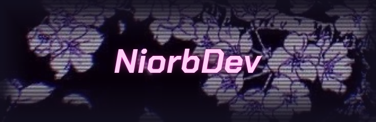
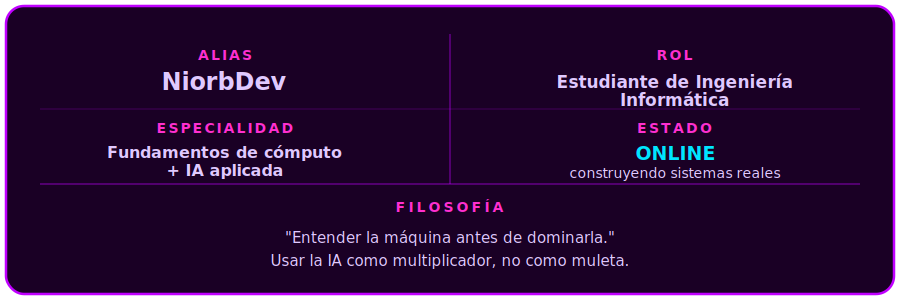

<div align="center">



<br>

[](https://git.io/typing-svg)

</div>

<br>

<div align="center">

```
> ACCESSING_PROFILE... [ACCESS GRANTED]
> LOADING IDENTITY_MODULE...
```

</div>

<br>

<div align="center">

</div>

<div align="center">



</div>

No busco ser otro dev de frontend. Mi enfoque parte desde abajo: arquitectura de computadores, sistemas operativos, algoritmos, teoría de la computación. Desde ahí subo hacia productos reales, usando herramientas modernas de IA como aceleradores de ingeniería, no como reemplazo del criterio técnico.

<br>

<div align="center">

</div>

<p align="center"><i>Lo que domino sin depender de IA</i></p>

<div align="center">


<br><br>


</div>

<br>

<div align="center">

</div>

<p align="center"><i>Herramientas que amplifican mi capacidad de ingeniería</i></p>

<div align="center">


</div>

<br>

```
┌──(niorb@system)-[~/multiplicadores_ia]
└─$ ./run_stack.sh --status

[OK] Diseño de arquitecturas asistido por IA
[OK] Investigación acelerada de tecnologías nuevas
[OK] Debugging y resolución de problemas complejos
[OK] Prototipado rápido de productos
[OK] Aprendizaje acelerado de herramientas y frameworks

[NOTA] La IA no reemplaza el fundamento. Lo multiplica.

└─$ _
```

<br>

<div align="center">

</div>

<p align="center"><i>Base académica, Ingeniería Informática</i></p>

<div align="center">

<table width="90%">
<tr>
<td width="33%" align="center" valign="top">


<div align="center">

Cálculo I · II · III<br>
Álgebra I · II<br>
Ecuaciones Diferenciales<br>
y Métodos Numéricos<br>
Estadística Computacional

</div>

</td>
<td width="33%" align="center" valign="top">


<div align="center">

Física I · II<br>
Electricidad, Magnetismo<br>
y Ondas<br>
Fundamentos de Economía<br>
Ingeniería y Sostenibilidad<br>
Intro. a Ing. Informática

</div>

</td>
<td width="33%" align="center" valign="top">


<div align="center">

Fund. de Programación<br>
Fund. de Computación<br>
Estructura de Datos<br>
Diseño de Algoritmos<br>
Teoría de la Computación<br>
Paradigmas de Programación<br>
Sistemas Operativos<br>
Arquitectura de Computadores<br>
Diseño de Bases de Datos<br>
Fund. de Ing. de Software<br>
Taller de Programación

</div>

</td>
</tr>
</table>

</div>

<br>

<div align="center">

</div>

<p align="center"><i>Proyectos en desarrollo</i></p>

<br>

<table width="100%">
<tr>
<td width="50%" valign="top" align="center">


<br><br>


<br><br>

**Tipo:** Plataforma educativa gamificada
**Misión:** Convertir el aprendizaje en una experiencia RPG

Mapa de progreso estilo videojuego. Regiones, unidades y lecciones. Aprendizaje adaptativo con repetición espaciada. Sistema de progreso y gamificación.


</td>
<td width="50%" valign="top" align="center">


<br><br>


<br><br>

**Tipo:** Aplicación móvil de bienestar con IA
**Misión:** Acompañar el bienestar del usuario mediante inteligencia artificial

App móvil multiplataforma con enfoque en salud mental y bienestar, con integración de IA.


</td>
</tr>
<tr>
<td width="50%" valign="top" align="center">


<br><br>


<br><br>

**Tipo:** Agente personal de desarrollo remoto
**Misión:** Conectar Telegram con Claude Code para operar herramientas de desarrollo desde cualquier lugar

Automatización de tareas, integración directa con Claude Code, gestión de contexto conversacional y ejecución remota de tareas.


</td>
<td width="50%" valign="top" align="center">


<br><br>


<br><br>

**Tipo:** Por definir
**Misión:** Por definir

```
[■■■■■■■■■■□□□□□□□□□□] 50%
Cargando próximo proyecto...
```

</td>
</tr>
</table>

<br>

<div align="center">

</div>

<div align="center">

Algo vive en el repositorio y se alimenta de tus commits.

<br>


</div>


<br>

<div align="center">

</div>

<div align="center">


<br>


</div>

<br>

<div align="center">

</div>

<div align="center">


</div>

<div align="center">

```
> connection_status: OPEN
> "No busco atajos. Busco entender el sistema completo,
   capa por capa, y luego construir algo que importe."
```


</div>
